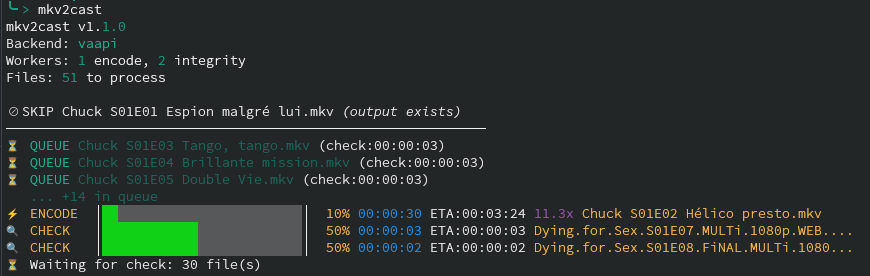

# mkv2cast

<!-- Badges de statut -->
[](https://github.com/voldardard/mkv2cast/actions/workflows/ci.yml)
[](https://github.com/voldardard/mkv2cast/actions/workflows/ci.yml)
[](https://github.com/voldardard/mkv2cast/actions/workflows/docs.yml)

<!-- Badges de version -->
[](https://pypi.org/project/mkv2cast/)
[](https://pypi.org/project/mkv2cast/)
[](https://pypi.org/project/mkv2cast/)

<!-- Badges de projet -->
[](https://www.gnu.org/licenses/gpl-3.0)
[](https://www.linux.org/)
[](https://github.com/astral-sh/ruff)

**Smart MKV to Chromecast-compatible converter with hardware acceleration**

Convert your MKV video files to formats compatible with Chromecast devices and Smart TVs, using intelligent codec detection and hardware-accelerated encoding.

<p align="center">
  
</p>

---

## Table of Contents

- [Features](#features)
- [Distribution](#distribution)
- [Purpose](#purpose)
- [Tested Devices](#tested-devices)
- [Prerequisites](#prerequisites)
- [Installation](#installation)
- [Configuration](#configuration)
- [Usage](#usage)
- [Using mkv2cast as a Python Package](#using-mkv2cast-as-a-python-package)
- [Options Reference](#options-reference)
- [Examples](#examples)
- [Maintenance](#maintenance)
- [Points de Vigilance](#points-de-vigilance)
- [Troubleshooting](#troubleshooting)
- [Contributing](#contributing)
- [Bug Reports](#bug-reports)
- [Roadmap](#roadmap)
- [Acknowledgments](#acknowledgments)
- [License](#license)

---

## Features

- **Intelligent Codec Detection**: Automatically analyzes video and audio streams to determine if transcoding is needed
- **Hardware Acceleration**: Supports Intel VAAPI and Quick Sync Video (QSV) for faster encoding
- **Parallel Processing**: Process multiple files simultaneously with configurable worker counts
- **Rich Progress Display**: Beautiful terminal UI with progress bars, ETA, and speed indicators
- **Integrity Checking**: Verifies source files before processing to avoid corrupted outputs
- **Conversion History**: Track all conversions with SQLite database and statistics
- **Flexible Filtering**: Include/exclude files using glob patterns or path filters
- **XDG Compliant**: Follows Linux standards for configuration, cache, and state directories
- **Automatic Audio Selection**: Prefers French audio tracks, falls back to first available
- **Configurable**: TOML/INI configuration file with sensible defaults
- **Desktop Notifications**: Get notified when conversions complete (via notify-send or plyer)
- **Multi-Language Support**: Available in English, French, Spanish, Italian, and German
- **PyPI Distribution**: Easy installation via `pip install mkv2cast`

---

## Distribution

| | |
|---|---|
| **Version** | 1.2.1 |
| **Author** | voldardard |
| **Date** | January 2026 |
| **License** | GPL-3.0 |
| **Repository** | https://github.com/voldardard/mkv2cast |
| **PyPI** | https://pypi.org/project/mkv2cast/ |
| **Documentation** | https://voldardard.github.io/mkv2cast |

---

## Purpose

**mkv2cast** was created to simplify the process of converting video files for playback on Chromecast devices and Smart TVs.

Many media files use codecs that aren't natively supported by Chromecast (like HEVC/H.265, AV1, or non-AAC audio). This tool:

1. **Analyzes** your MKV files to detect incompatible codecs
2. **Transcodes** only what's necessary (video, audio, or both)
3. **Preserves** compatible streams by copying them without re-encoding
4. **Outputs** Chromecast-compatible files ready for streaming

### Integration with catt

This tool is designed to work seamlessly with [catt](https://github.com/skorokithakis/catt) (Cast All The Things), a command-line tool for casting videos to Chromecast devices:

```bash
# Convert your files first
mkv2cast movie.mkv

# Then cast to your TV
catt cast movie.h264.aac.cast.mkv
```

---

## Tested Devices

mkv2cast has been tested and confirmed working with:

| Device | Status | Notes |
|--------|--------|-------|
| **TCL 55C635** | ✅ Verified | Primary test device, 4K HDR |
| **TCL 65C735** | ✅ Verified | Similar to 55C635 |
| **Chromecast (Gen 3)** | ✅ Verified | 1080p |
| **Chromecast with Google TV** | ✅ Verified | 4K HDR |
| **Chromecast Ultra** | ✅ Verified | 4K HDR |

> **Note**: If you test with other devices, please submit a PR to update this list!

---

## Prerequisites

### Required

| Dependency | Version | Installation |
|------------|---------|--------------|
| **Python** | 3.8+ | Pre-installed on most Linux systems |
| **ffmpeg** | 4.0+ | `sudo pacman -S ffmpeg` (Arch) / `sudo apt install ffmpeg` (Debian) |
| **ffprobe** | 4.0+ | Included with ffmpeg |

### Optional (Recommended)

| Package | Purpose | Installation |
|---------|---------|--------------|
| **rich** | Beautiful progress UI | See below |
| **tomli** | TOML config support (Python < 3.11) | See below |

**Installing optional packages:**

```bash
# Arch Linux (recommended - system packages)
sudo pacman -S python-rich
sudo pacman -S python-tomli  # Only needed for Python < 3.11

# Debian/Ubuntu
pip install --user rich tomli

# Other distributions
pip install --user rich tomli
```

### Hardware Acceleration

For hardware-accelerated encoding:

- **Intel VAAPI**: Install `intel-media-driver` or `libva-intel-driver`
- **Intel QSV**: Install `intel-media-sdk` or `oneVPL`

Check your hardware support:

```bash
# List available encoders
ffmpeg -encoders 2>/dev/null | grep -E 'vaapi|qsv'

# Test VAAPI
ls -la /dev/dri/renderD128

# Check with mkv2cast
mkv2cast --check-requirements
```

---

## Installation

### PyPI (Recommended) 🚀

```bash
# Basic installation
pip install mkv2cast

# With all optional features (rich UI, notifications)
pip install "mkv2cast[full]"
```

### Arch Linux (AUR)

```bash
yay -S mkv2cast
# or
paru -S mkv2cast
```

### Debian/Ubuntu (APT Repository)

Add the official APT repository for automatic updates:

```bash
# Add the repository
echo "deb [trusted=yes] https://voldardard.github.io/mkv2cast/apt stable main" | sudo tee /etc/apt/sources.list.d/mkv2cast.list

# Update and install
sudo apt update
sudo apt install mkv2cast
```

Or download the `.deb` package directly from [GitHub Releases](https://github.com/voldardard/mkv2cast/releases):

```bash
# Download and install specific version
wget https://github.com/voldardard/mkv2cast/releases/download/v1.1.2/mkv2cast_1.1.2-1_all.deb
sudo dpkg -i mkv2cast_1.1.2-1_all.deb
sudo apt-get install -f  # Install dependencies
```

### Script Install (One-Liner)

```bash
curl -fsSL https://raw.githubusercontent.com/voldardard/mkv2cast/main/install.sh | bash
```

The installer will:
- Download mkv2cast automatically
- Install to `~/.local/bin/`
- Set up man page and shell completions
- Configure your PATH automatically (if needed)

After installation, reload your shell or run:

```bash
source ~/.bashrc  # or ~/.zshrc for Zsh users
```

### Update

```bash
# PyPI
pip install --upgrade mkv2cast

# Script
curl -fsSL https://raw.githubusercontent.com/voldardard/mkv2cast/main/install.sh | bash -s -- --update
```

### System-Wide Installation

For servers or multi-user systems, install to `/usr/local`:

```bash
curl -fsSL https://raw.githubusercontent.com/voldardard/mkv2cast/main/install.sh | sudo bash -s -- --system
```

**System-wide cleanup**: When cleanup commands are run as root, mkv2cast automatically cleans temp files and logs for all users:

```bash
# Clean temp files for all users (as root)
sudo mkv2cast --clean-tmp

# Clean logs for all users (as root)
sudo mkv2cast --clean-logs 30
```

A system-wide systemd timer is also available for automated cleanup.

### Installation Options

| Option | Description |
|--------|-------------|
| `--user` | Install for current user only (default) |
| `--system` | Install system-wide (requires sudo) |
| `--update` | Update existing installation |
| `--uninstall` | Remove mkv2cast |
| `--with-systemd` | Install cleanup timer |
| `--no-modify-rc` | Don't modify shell config files |

### Alternative: Manual Clone

If you prefer to clone the repository:

```bash
git clone https://github.com/voldardard/mkv2cast.git
cd mkv2cast
./install.sh
```

### Verify Installation

```bash
mkv2cast --version
mkv2cast --check-requirements
man mkv2cast
```

### Uninstallation

```bash
# Quick uninstall
mkv2cast-uninstall

# Or via curl
curl -fsSL https://raw.githubusercontent.com/voldardard/mkv2cast/main/install.sh | bash -s -- --uninstall
```

### Installation Paths

| Mode | Script | Man Page | Completions | Config |
|------|--------|----------|-------------|--------|
| **User** | `~/.local/bin` | `~/.local/share/man/man1` | `~/.local/share/bash-completion` | `~/.config/mkv2cast` |
| **System** | `/usr/local/bin` | `/usr/local/share/man/man1` | `/etc/bash_completion.d` | `/etc/mkv2cast` |

---

## Configuration

### Configuration Files

mkv2cast uses a layered configuration system:

1. **System config** (optional): `/etc/mkv2cast/config.toml`
   - Applied to all users
   - Created only with `--system` installation
   
2. **User config**: `~/.config/mkv2cast/config.toml`
   - Per-user settings
   - Overrides system config
   - Created automatically on first run

> **Priority**: User config values always override system config values.

### Example config.toml

```toml
[output]
suffix = ".cast"
container = "mkv"

[scan]
recursive = true
ignore_patterns = ["*sample*", "*.eng.*"]
ignore_paths = []
include_patterns = []
include_paths = []

[encoding]
backend = "auto"  # auto, vaapi, qsv, cpu
crf = 20
preset = "slow"
abr = "192k"

[workers]
encode = 0       # 0 = auto-detect
integrity = 0    # 0 = auto-detect

[integrity]
enabled = true
stable_wait = 3
deep_check = false
```

### Directory Structure

mkv2cast follows the [XDG Base Directory Specification](https://specifications.freedesktop.org/basedir-spec/basedir-spec-latest.html):

**User directories:**

| Directory | Purpose | Default Path |
|-----------|---------|--------------|
| Config | User configuration | `~/.config/mkv2cast/` |
| State | History, logs | `~/.local/state/mkv2cast/` |
| Cache | Temporary files | `~/.cache/mkv2cast/` |

**System directories** (only for system-wide installation):

| Directory | Purpose | Default Path |
|-----------|---------|--------------|
| Config | System-wide defaults | `/etc/mkv2cast/` |

View all directories:

```bash
mkv2cast --show-dirs
```

---

## Usage

### Basic Usage

```bash
# Process all MKV files in current directory (recursive)
mkv2cast

# Process a single file
mkv2cast movie.mkv

# Process with debug output
mkv2cast --debug movie.mkv

# Dry run (show what would be done)
mkv2cast --dryrun
```

### Output File Naming

Output files are named based on transformations applied:

| Input | Output | Meaning |
|-------|--------|---------|
| `movie.mkv` | `movie.h264.cast.mkv` | Video transcoded to H.264 |
| `movie.mkv` | `movie.aac.cast.mkv` | Audio transcoded to AAC |
| `movie.mkv` | `movie.h264.aac.cast.mkv` | Both transcoded |
| `movie.mkv` | `movie.remux.cast.mkv` | Container changed only |

### Common Workflows

#### Convert entire movie collection

```bash
cd /path/to/movies
mkv2cast
```

#### Convert only French movies from 2024

```bash
mkv2cast -i '*French*' -i '*2024*'
```

#### Fast encoding (lower quality)

```bash
mkv2cast --hw cpu --preset fast --crf 23
```

#### High quality with hardware acceleration

```bash
mkv2cast --hw vaapi --vaapi-qp 20
```

#### Process without recursive scan

```bash
mkv2cast --no-recursive
```

---

## Using mkv2cast as a Python Package

mkv2cast can be imported and used as a Python library in your scripts, allowing you to programmatically convert video files with full control over the conversion process.

### Installation

First, ensure mkv2cast is installed:

```bash
pip install mkv2cast
```

### Basic Usage

The simplest way to use mkv2cast programmatically is with the `convert_file` function:

```python
from mkv2cast import convert_file
from pathlib import Path

# Convert a single file
success, output_path, message = convert_file(Path("movie.mkv"))

if success:
    if output_path:
        print(f"Converted to: {output_path}")
    else:
        print(f"Skipped: {message}")
else:
    print(f"Failed: {message}")
```

### Configuration

Create a custom configuration to control encoding settings:

```python
from mkv2cast import Config, convert_file
from pathlib import Path

# Create custom configuration
config = Config(
    hw="vaapi",           # Use VAAPI hardware acceleration
    crf=20,               # Quality setting (lower = better quality)
    preset="slow",        # Encoding preset
    container="mp4",      # Output container format
    suffix=".cast",       # Output file suffix
    notify=False          # Disable notifications in scripts
)

# Convert with custom config
success, output_path, message = convert_file(
    Path("movie.mkv"),
    cfg=config
)
```

### JSON Progress Output

For integration with web UIs or monitoring tools, use `--json-progress`:

```bash
mkv2cast --json-progress movie.mkv
```

This outputs JSON events to stdout:

```json
{"version":"1.0","event":"start","overall":{"total_files":1,"backend":"vaapi"}}
{"version":"1.0","event":"file_start","file":"movie.mkv"}
{"version":"1.0","event":"progress","files":{"movie.mkv":{"progress_percent":45.2,"fps":120.5,"eta_seconds":30}}}
{"version":"1.0","event":"file_done","file":"movie.mkv","status":"done"}
{"version":"1.0","event":"complete"}
```

### Using JSON Progress in Python

```python
import json
import subprocess
from typing import Generator, Dict, Any

def stream_progress(filepath: str) -> Generator[Dict[str, Any], None, None]:
    """Stream JSON progress events from mkv2cast."""
    proc = subprocess.Popen(
        ["mkv2cast", "--json-progress", filepath],
        stdout=subprocess.PIPE,
        text=True
    )
    for line in proc.stdout:
        yield json.loads(line)

# Example: Display progress
for event in stream_progress("movie.mkv"):
    if event["event"] == "progress":
        for filename, data in event.get("files", {}).items():
            print(f"{filename}: {data['progress_percent']:.1f}%")
```

### Advanced: Progress Callbacks

Instead of parsing JSON output, use progress callbacks directly in your Python code:

```python
from mkv2cast import convert_file, Config
from pathlib import Path

def on_progress(filepath: Path, progress: dict):
    """Called during conversion with progress updates."""
    stage = progress.get("stage", "unknown")
    percent = progress.get("progress_percent", 0)
    fps = progress.get("fps", 0)
    eta = progress.get("eta_seconds", 0)
    
    print(f"{filepath.name}: {stage} - {percent:.1f}% @ {fps:.1f}fps, ETA: {eta:.0f}s")

config = Config.for_library(hw="auto")  # Auto-disables UI for library usage

success, output, msg = convert_file(
    Path("movie.mkv"),
    cfg=config,
    progress_callback=on_progress
)
```

**Progress callback receives:**

| Field | Type | Description |
|-------|------|-------------|
| `stage` | str | "checking", "encoding", "done", "skipped", "failed" |
| `progress_percent` | float | Progress percentage (0-100) |
| `fps` | float | Current encoding FPS |
| `eta_seconds` | float | Estimated time remaining |
| `bitrate` | str | Current bitrate (e.g., "2500kbits/s") |
| `speed` | str | Encoding speed (e.g., "2.5x") |
| `current_time_ms` | int | Current position in milliseconds |
| `duration_ms` | int | Total duration in milliseconds |
| `error` | str/None | Error message if stage is "failed" |

### Batch Processing with Multi-threading

Process multiple files in parallel using `convert_batch()`:

```python
from mkv2cast import convert_batch, Config
from pathlib import Path

config = Config.for_library(
    hw="vaapi",
    encode_workers=2,      # 2 parallel encoders
)

def on_progress(filepath: Path, progress: dict):
    """Thread-safe callback for progress updates."""
    percent = progress.get("progress_percent", 0)
    stage = progress.get("stage", "")
    print(f"{filepath.name}: {stage} {percent:.1f}%")

files = [Path("movie1.mkv"), Path("movie2.mkv"), Path("movie3.mkv")]

results = convert_batch(
    files,
    cfg=config,
    progress_callback=on_progress
)

# Check results
for filepath, (success, output, msg) in results.items():
    if success:
        print(f"OK {filepath.name}: {msg}")
    else:
        print(f"FAIL {filepath.name}: {msg}")
```

### Script Mode (No Colors/Output)

When used as a library, mkv2cast can automatically disable:

- Progress bars
- Colored output
- Desktop notifications
- Rich UI

**Automatic detection** happens when:

- `sys.stdout` is not a TTY (piped or redirected)
- `NO_COLOR` environment variable is set
- `MKV2CAST_SCRIPT_MODE=1` is set

**Recommended for library usage:**

```python
# Use Config.for_library() which auto-disables UI features
config = Config.for_library(hw="vaapi", crf=20)

# Or manually disable
config = Config(
    progress=False,    # No progress bars
    notify=False,      # No notifications
    pipeline=False,    # No Rich UI
)
```

### Analyzing Files

Before converting, you can analyze a file to see what transcoding is needed:

```python
from mkv2cast import decide_for, pick_backend
from pathlib import Path

# Analyze a file
decision = decide_for(Path("movie.mkv"))

print(f"Video codec: {decision.vcodec}")
print(f"Audio codec: {decision.acodec}")
print(f"Needs video transcode: {decision.need_v}")
print(f"Needs audio transcode: {decision.need_a}")
print(f"Reason: {decision.reason_v}")

# Check available backend
backend = pick_backend()
print(f"Best backend: {backend}")
```

### Batch Processing (Sequential)

Process multiple files sequentially with custom logic:

```python
from pathlib import Path
from mkv2cast import convert_file, Config

config = Config.for_library(hw="auto", container="mkv")

input_dir = Path("/media/videos")
output_dir = Path("/media/converted")

for mkv_file in input_dir.glob("**/*.mkv"):
    success, output, msg = convert_file(
        mkv_file,
        cfg=config,
        output_dir=output_dir
    )
    
    if success and output:
        print(f"OK {mkv_file.name} -> {output.name}")
    elif not success:
        print(f"FAIL {mkv_file.name}: {msg}")
    else:
        print(f"SKIP {mkv_file.name}: {msg}")
```

For parallel batch processing, see [Batch Processing with Multi-threading](#batch-processing-with-multi-threading) above.

### Advanced: Building Custom Commands

For more control, you can build FFmpeg commands manually:

```python
from mkv2cast import decide_for, pick_backend, build_transcode_cmd, Config
from pathlib import Path
import subprocess

input_file = Path("movie.mkv")
output_file = Path("movie.h264.cast.mkv")
config = Config()

# Analyze file
decision = decide_for(input_file, config)

# Select backend
backend = pick_backend(config)

# Build command
cmd, stage = build_transcode_cmd(
    input_file,
    decision,
    backend,
    output_file,
    log_path=None,  # Optional: Path to log file
    cfg=config
)

# Run manually
result = subprocess.run(cmd)
```

### Working with History

Access conversion history programmatically:

```python
from mkv2cast import HistoryDB, get_app_dirs

# Get history database
dirs = get_app_dirs()
history = HistoryDB(dirs["state"])

# Get recent conversions
recent = history.get_recent(20)
for entry in recent:
    print(f"{entry['status']}: {entry['input_path']}")

# Get statistics
stats = history.get_stats()
print(f"Total conversions: {sum(stats['by_status'].values())}")
```

### Loading Configuration Files

Load settings from configuration files:

```python
from mkv2cast import load_config_file, get_app_dirs, Config

# Get config directory
dirs = get_app_dirs()

# Load config file (TOML or INI)
file_config = load_config_file(dirs["config"])

# Create config and manually apply settings from file
config = Config()
if "encoding" in file_config:
    if "backend" in file_config["encoding"]:
        config.hw = file_config["encoding"]["backend"]
    if "crf" in file_config["encoding"]:
        config.crf = file_config["encoding"]["crf"]
    # ... apply other settings as needed
```

### Available Functions and Classes

Main exports from `mkv2cast`:

| Function/Class | Description |
|----------------|-------------|
| **`convert_file()`** | Convert a single file with optional progress callback |
| **`convert_batch()`** | Convert multiple files in parallel with multi-threading |
| **`decide_for()`** | Analyze what transcoding is needed for a file |
| **`pick_backend()`** | Auto-detect best encoding backend |
| **`build_transcode_cmd()`** | Build FFmpeg command manually |
| **`Config`** | Configuration dataclass with `for_library()` factory |
| **`Config.for_library()`** | Create config optimized for library usage |
| **`Decision`** | Analysis result dataclass |
| **`HistoryDB`** | Conversion history database |
| **`get_app_dirs()`** | Get XDG directories |
| **`load_config_file()`** | Load config from file |
| **`is_script_mode()`** | Check if running in script/library mode |
| **`send_notification()`** | Send desktop notification |
| **`setup_i18n()`** | Setup internationalization |

For detailed API documentation, see the [API Reference](https://voldardard.github.io/mkv2cast/api/index.html).

---

## Options Reference

### General Options

| Option | Description |
|--------|-------------|
| `-h, --help` | Show help message |
| `-V, --version` | Show version information |
| `--check-requirements` | Check system requirements |

### Output Settings

| Option | Default | Description |
|--------|---------|-------------|
| `--suffix SUFFIX` | `.cast` | Output file suffix |
| `--container FORMAT` | `mkv` | Output format: `mkv` or `mp4` |

### Scan Settings

| Option | Default | Description |
|--------|---------|-------------|
| `-r, --recursive` | enabled | Scan directories recursively |
| `--no-recursive` | - | Disable recursive scanning |
| `-I, --ignore-pattern PATTERN` | - | Ignore files matching glob pattern |
| `--ignore-path PATH` | - | Ignore specific paths/folders |
| `-i, --include-pattern PATTERN` | - | Only process matching files |
| `--include-path PATH` | - | Only process files in path |

### Codec Decisions

| Option | Default | Description |
|--------|---------|-------------|
| `--skip-when-ok` | enabled | Skip compatible files |
| `--no-skip-when-ok` | - | Process all files |
| `--force-h264` | disabled | Force H.264 transcoding |
| `--allow-hevc` | disabled | Allow HEVC passthrough |
| `--force-aac` | disabled | Force AAC transcoding |
| `--keep-surround` | disabled | Keep surround audio |
| `--no-silence` | - | Don't add silence track |

### Encoding Quality

| Option | Default | Description |
|--------|---------|-------------|
| `--abr BITRATE` | `192k` | Audio bitrate |
| `--crf VALUE` | `20` | CRF for CPU encoding (18-28) |
| `--preset PRESET` | `slow` | x264 preset |

### Hardware Acceleration

| Option | Default | Description |
|--------|---------|-------------|
| `--hw BACKEND` | `auto` | Backend: `auto`, `nvenc`, `amf`, `qsv`, `vaapi`, `cpu` |
| `--vaapi-device PATH` | `/dev/dri/renderD128` | VAAPI device |
| `--vaapi-qp VALUE` | `23` | VAAPI quality |
| `--qsv-quality VALUE` | `23` | QSV quality |
| `--nvenc-cq VALUE` | `23` | NVENC constant quality (0-51) |
| `--amf-quality VALUE` | `23` | AMD AMF quality (0-51) |

### Integrity Checks

| Option | Default | Description |
|--------|---------|-------------|
| `--integrity-check` | enabled | Enable integrity check |
| `--no-integrity-check` | - | Disable integrity check |
| `--stable-wait SECONDS` | `3` | Wait for file stability |
| `--deep-check` | disabled | Deep decode verification |

### Parallelism

| Option | Default | Description |
|--------|---------|-------------|
| `--pipeline` | enabled | Parallel processing |
| `--no-pipeline` | - | Sequential mode |
| `--encode-workers N` | `0` (auto) | Parallel encoding workers |
| `--integrity-workers N` | `0` (auto) | Parallel integrity workers |

### JSON Progress Output

| Option | Default | Description |
|--------|---------|-------------|
| `--json-progress` | disabled | Output structured JSON progress |

### Utility Commands

| Option | Description |
|--------|-------------|
| `--show-dirs` | Show XDG directory paths |
| `--history [N]` | Show recent conversions (default: 20, max: 1000) |
| `--history-stats` | Show conversion statistics |
| `--clean-tmp` | Remove orphaned temp files (all users if root) |
| `--clean-logs DAYS` | Remove old log files (all users if root) |
| `--clean-history DAYS` | Remove old history entries |

---

## Examples

### Filtering Examples

```bash
# Ignore sample files and English tracks
mkv2cast -I '*sample*' -I '*.eng.*'

# Process only French content
mkv2cast -i '*French*' -i '*VFF*' -i '*FRENCH*'

# Ignore specific folders
mkv2cast --ignore-path Downloads/temp --ignore-path "To Sort"

# Process only specific folder
mkv2cast --include-path Movies/2024
```

### Encoding Examples

```bash
# Use CPU with fast preset (quick, lower quality)
mkv2cast --hw cpu --preset fast --crf 23

# Use VAAPI with high quality
mkv2cast --hw vaapi --vaapi-qp 18

# Keep surround sound
mkv2cast --keep-surround --abr 256k

# Output to MP4 instead of MKV
mkv2cast --container mp4
```

### Parallel Processing Examples

```bash
# Use 3 parallel encoders
mkv2cast --encode-workers 3

# Disable parallel processing
mkv2cast --no-pipeline

# Custom worker configuration
mkv2cast --encode-workers 2 --integrity-workers 4
```

### Maintenance Examples

```bash
# View conversion history (default: 20 lines)
mkv2cast --history

# View more history (50 or 100 lines)
mkv2cast --history 50
mkv2cast --history 100

# View statistics
mkv2cast --history-stats

# Clean temporary files
mkv2cast --clean-tmp

# Clean logs older than 30 days
mkv2cast --clean-logs 30

# Clean history older than 90 days
mkv2cast --clean-history 90
```

---

## Maintenance

### Automatic Cleanup with systemd

Install the systemd timer for weekly automatic cleanup:

```bash
./install.sh --with-systemd
```

Or manually:

```bash
# Copy service files
cp systemd/mkv2cast-cleanup.* ~/.config/systemd/user/

# Enable timer
systemctl --user enable --now mkv2cast-cleanup.timer

# Check status
systemctl --user status mkv2cast-cleanup.timer
```

### Automatic Cleanup with cron

Add to your crontab (`crontab -e`):

```cron
# Weekly cleanup on Sunday at 3 AM
0 3 * * 0 mkv2cast --clean-tmp && mkv2cast --clean-logs 30
```

### Manual Cleanup

```bash
# Clean orphaned temp files
mkv2cast --clean-tmp

# Clean logs older than 30 days
mkv2cast --clean-logs 30

# Clean history older than 90 days
mkv2cast --clean-history 90
```

---

## Points de Vigilance

### Important Notes

1. **Recursive Scanning is Default**
   - mkv2cast scans subdirectories by default
   - Use `--no-recursive` to process only the current directory
   - Be careful when running in large directory trees!

2. **Original Files are Preserved**
   - mkv2cast creates new output files, it does NOT modify originals
   - Output files have a distinct suffix (`.cast.mkv` by default)

3. **Temporary Files**
   - During encoding, temp files are created in `~/.cache/mkv2cast/tmp/`
   - They are automatically cleaned on successful completion
   - Use `--clean-tmp` to remove orphaned temp files after interruption

4. **French Audio Preference**
   - By default, mkv2cast selects French audio tracks when available
   - Falls back to the first audio track if no French track found

5. **HEVC/H.265 Transcoding**
   - By default, HEVC content is transcoded to H.264
   - Use `--allow-hevc` if your device supports HEVC

6. **Disk Space**
   - Ensure sufficient disk space for output files
   - Temporary files can also consume significant space during encoding

---

## Troubleshooting

### Common Issues

#### "ffmpeg not found"

```bash
# Arch Linux
sudo pacman -S ffmpeg

# Debian/Ubuntu
sudo apt install ffmpeg

# Fedora
sudo dnf install ffmpeg
```

#### "VAAPI encoding failed"

```bash
# Check VAAPI device exists
ls -la /dev/dri/

# Install Intel drivers (for Intel GPUs)
sudo pacman -S intel-media-driver  # Arch
sudo apt install intel-media-va-driver  # Debian

# Test with mkv2cast
mkv2cast --check-requirements
```

#### "No progress display"

Install the `rich` Python package:

```bash
# Arch Linux
sudo pacman -S python-rich

# Other distributions
pip install --user rich
```

#### "Permission denied" errors

Ensure the script is executable and in your PATH:

```bash
chmod +x ~/.local/bin/mkv2cast
echo $PATH | grep -q ".local/bin" || echo 'export PATH="$HOME/.local/bin:$PATH"' >> ~/.bashrc
```

#### "TOML config not loading"

For Python < 3.11, install tomli:

```bash
# Arch Linux
sudo pacman -S python-tomli

# Other distributions
pip install --user tomli
```

### Getting Help

```bash
# Check requirements
mkv2cast --check-requirements

# View debug output
mkv2cast --debug movie.mkv

# Dry run to see commands
mkv2cast --dryrun movie.mkv

# Check logs
ls ~/.local/state/mkv2cast/logs/
```

---

## Contributing

Contributions are welcome! Here's how to get started:

### Development Setup

```bash
# Clone the repository
git clone https://github.com/voldardard/mkv2cast.git
cd mkv2cast

# Install development dependencies
# Arch Linux:
sudo pacman -S python-rich python-tomli
# Other distributions:
pip install --user rich tomli

# Run tests
python mkv2cast.py --check-requirements
```

### Submitting Changes

1. Fork the repository
2. Create a feature branch: `git checkout -b feature/my-feature`
3. Make your changes
4. Test thoroughly
5. Commit with descriptive message: `git commit -m "Add feature X"`
6. Push to your fork: `git push origin feature/my-feature`
7. Open a Pull Request

### Code Style

- Follow PEP 8 for Python code
- Add docstrings to new functions
- Update documentation for new features
- Test on both CPU and hardware-accelerated backends if possible

---

## Bug Reports

Found a bug? Please report it!

### How to Report

1. Go to [GitHub Issues](https://github.com/voldardard/mkv2cast/issues)
2. Click "New Issue"
3. Include:
   - Your operating system and version
   - Python version (`python3 --version`)
   - FFmpeg version (`ffmpeg -version`)
   - mkv2cast version (`mkv2cast --version`)
   - Output of `mkv2cast --check-requirements`
   - Steps to reproduce the bug
   - Error messages or log files (from `~/.local/state/mkv2cast/logs/`)

### Example Bug Report

```
### Environment
- OS: Arch Linux 2026.01
- Python: 3.12.1
- FFmpeg: 7.0
- mkv2cast: 1.0.0

### Description
Encoding fails with VAAPI on AMD GPU...

### Steps to Reproduce
1. Run `mkv2cast --hw vaapi movie.mkv`
2. Error occurs at 15%

### Error Output
[paste error here]
```

---

## Web Interface

Looking for a web-based interface? Check out **[mkv2castUI](https://github.com/voldardard/mkv2castUI)** - a full-featured web application for mkv2cast with:

- 🌐 **Web Upload**: Drag and drop MKV files for conversion
- 📊 **Real-time Progress**: WebSocket-based progress tracking
- 🔐 **OAuth Authentication**: Sign in with Google or GitHub
- 💳 **Subscription Tiers**: Free, Pro, and Enterprise plans
- 🐳 **Docker Ready**: Easy deployment with Docker Compose

```bash
git clone https://github.com/voldardard/mkv2castUI.git
cd mkv2castUI
docker-compose up -d
```

---

## Roadmap

| Feature | Priority | Complexity | Status |
|---------|----------|------------|--------|
| NVIDIA NVENC support | High | Medium | 🚧 In Progress |
| Audio track selection | High | Low | 🚧 In Progress |
| Subtitle selection | High | Medium | 🚧 In Progress |
| Watch mode (inotify) | Medium | Medium | 🚧 In Progress |
| Profiles (fast/balanced/quality) | Medium | Low | Planned |
| HDR to SDR tone mapping | Low | High | Planned |
| Webhooks notifications | Low | Low | Planned |
| AMD AMF support | Low | Medium | Planned |
| Metadata preservation | Low | Medium | Planned |
| Integration Plex/Jellyfin | Low | High | Planned |

### Recent Additions (v1.1.x)

- ✅ Multi-language support (EN, FR, ES, IT, DE)
- ✅ Desktop notifications
- ✅ PyPI distribution
- ✅ Comprehensive test suite
- ✅ GitHub Actions CI/CD
- ✅ AUR & Debian packaging
- ✅ APT repository for Debian/Ubuntu
- ✅ Sphinx documentation on GitHub Pages

Have a feature request? [Open an issue](https://github.com/voldardard/mkv2cast/issues)!

---

## Acknowledgments

*This section will be updated as the project grows.*

Thanks to:
- The FFmpeg team for their incredible media processing tools
- The `rich` library for beautiful terminal interfaces
- All contributors and users who report bugs and suggest improvements

---

## License

This project is licensed under the **GNU General Public License v3.0**.

```
mkv2cast - Smart MKV to Chromecast-compatible converter
Copyright (C) 2024-2026 voldardard

This program is free software: you can redistribute it and/or modify
it under the terms of the GNU General Public License as published by
the Free Software Foundation, either version 3 of the License, or
(at your option) any later version.

This program is distributed in the hope that it will be useful,
but WITHOUT ANY WARRANTY; without even the implied warranty of
MERCHANTABILITY or FITNESS FOR A PARTICULAR PURPOSE. See the
GNU General Public License for more details.

You should have received a copy of the GNU General Public License
along with this program. If not, see <https://www.gnu.org/licenses/>.
```

See the [LICENSE](LICENSE) file for the full license text.

---

<p align="center">
Made with ❤️ for the media enthusiast community
</p>
